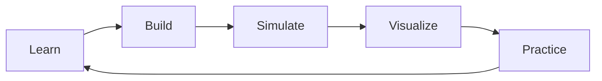
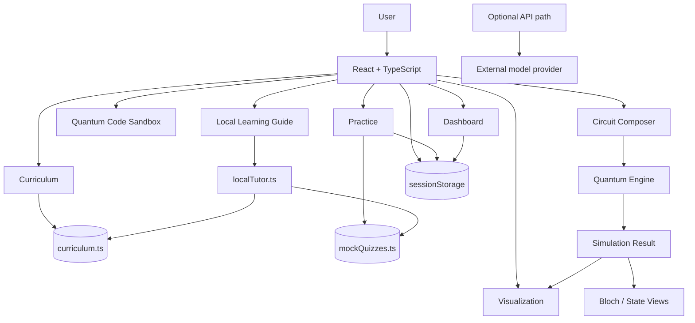
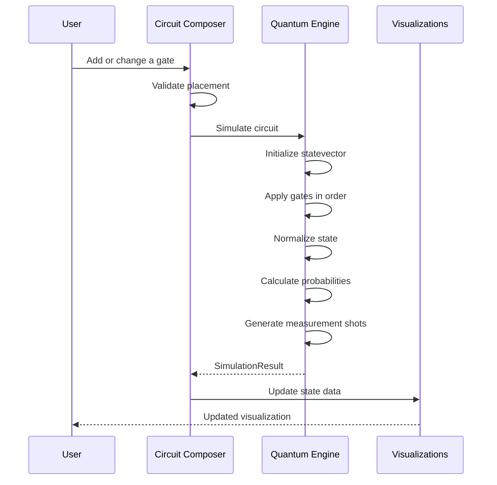
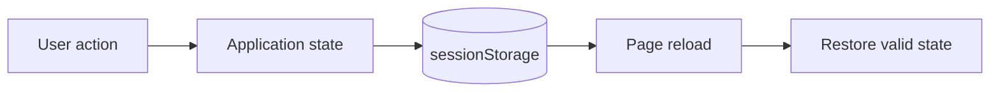
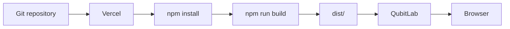

<div align="center">


# QubitLab

### Learn quantum computing by actually working with it.

Build a circuit. Run it. See the state change. Understand why. Test yourself.

[](https://react.dev/)
[](https://www.typescriptlang.org/)
[](https://vite.dev/)
[](https://threejs.org/)
[](https://tailwindcss.com/)
[](https://vercel.com/)

[Overview](#overview) · [Features](#features) · [How it works](#how-it-works) · [Architecture](#architecture) · [Setup](#getting-started) · [Security](#security) · [Deployment](#deployment)

</div>

---

## Overview

QubitLab is a browser-based learning platform for exploring quantum computing through interaction rather than theory alone.

The idea is straightforward: learn a concept, build a small circuit, simulate it, inspect the result, and then use practice questions to check whether the concept actually makes sense.

```text
LEARN → BUILD → SIMULATE → VISUALIZE → PRACTICE
  ↑                                             ↓
  └─────────────────────────────────────────────┘
```

It is designed as a learning lab. It is not intended to replace real quantum hardware, production quantum SDKs, or large-scale scientific simulators.

### Why QubitLab?

Quantum computing becomes difficult for beginners when the connection between the math and the circuit is hard to see.

QubitLab tries to make that connection visible:

- change a gate and see the state change
- inspect amplitudes and probabilities instead of only reading formulas
- view the same state through different visualizations
- experiment with common circuits and presets
- practice the concepts immediately after exploring them

The goal is not to hide the mathematics. It is to give the mathematics somewhere concrete to live.

---

## Features

### Learn

- Structured quantum-computing curriculum
- Foundations, core concepts, gates and circuits, mathematics, and algorithms
- Learning objectives for each topic
- Topic difficulty, duration, and prerequisites

### Build circuits

The Circuit Composer is the hands-on part of the project.

- 1–5 configurable qubits
- 4–12 configurable circuit steps
- `H`, `X`, `Y`, `Z`, `S`, `T`, `Rx`, `Ry`, `Rz`
- `S†` and `T†`
- `CNOT` and `CZ`
- `SWAP` and `CCNOT`
- Measurement markers
- Multi-qubit gate placement validation
- Bell, GHZ, Superposition, Grover, Deutsch, and Teleportation presets
- Step-by-step circuit scrubbing
- Clear and reset controls

### Simulate

The Circuit Composer is backed by a client-side state-vector simulator. The displayed state is calculated from the circuit rather than being a visual-only mock-up.

The engine handles:

- Complex amplitudes
- State-vector evolution
- Gate-by-gate simulation
- Basis-state probabilities
- Measurement-shot sampling
- Numerical state normalization
- Bloch-vector extraction
- Dirac notation
- Entanglement-aware inspection

### Visualize

Simulation results can be explored through:

- State-vector amplitudes
- Probabilities
- Relative phase
- Measurement histograms
- Dirac notation
- Bloch-sphere visualization
- Interactive 3D views using Three.js/WebGL

### Export

Circuits can be exported as educational code for:

- **Qiskit**
- **PennyLane**
- **Cirq**
- **OpenQASM**

The generated code is intended for learning and experimentation. Always check it against the SDK or compiler version you plan to use.

### Practice and progress

- Module-based MCQs
- Immediate feedback and explanations
- Score calculation
- Best-score tracking for the current browser session
- Session-based learner progress
- Dashboard summaries

---

## How It Works

### 1. Learn a concept

Pick a topic from the curriculum and start with the underlying idea. Topics include learning objectives, difficulty, duration, and prerequisites.

### 2. Build a circuit

Open the Circuit Composer and place gates on the qubit wires.

For example, a Bell-state circuit can be represented as:

```text
q₀ ── H ──●────
          │
q₁ ───────X────
```

The composer tracks the qubits, circuit steps, gate parameters, and multi-qubit relationships.

### 3. Simulate it

When the circuit changes, the current circuit is passed through the quantum engine.

```text
Circuit
   ↓
Validate gate placement
   ↓
Initialize |00...0⟩
   ↓
Apply gates in order
   ↓
Normalize numerical state
   ↓
Calculate probabilities
   ↓
Sample measurements
   ↓
SimulationResult
```

This keeps the circuit view and the result view tied to the same state calculation.

### 4. Inspect the result

The result can be explored through amplitudes, probabilities, phases, measurement shots, Dirac notation, and Bloch-sphere information.

The useful questions are the simple ones:

> What changed after the H gate?
>
> Why did the probabilities change?
>
> What did the CNOT do to the two-qubit state?

### 5. Practice

After experimenting, move to the practice modules and check whether the concept stuck.



---

## Architecture

Most of QubitLab runs directly in the browser.



### Main responsibilities

| Location | Responsibility |
|---|---|
| `src/components/` | UI and feature components |
| `src/data/` | Curriculum and quiz content |
| `src/types/` | Shared TypeScript domain types |
| `src/utils/quantumEngine.ts` | State-vector simulation and quantum operations |
| `src/utils/localTutor.ts` | Offline knowledge retrieval and responses |
| `src/utils/progress.ts` | Session-based progress handling |
| `api/chat.ts` | Optional model-backed API endpoint |
| `server/index.ts` | Optional Express/Vite runtime |
| `vercel.json` | Vercel build and SPA routing configuration |

---

## Circuit Simulation



The circuit diagram is not treated as a separate animation. The visual result is driven by the simulated state.

---

## Quantum Engine

The simulation core lives in:

```text
src/utils/quantumEngine.ts
```

| Category | Operations |
|---|---|
| Basic | `H`, `X`, `Y`, `Z` |
| Phase | `S`, `S†`, `T`, `T†` |
| Rotations | `Rx(θ)`, `Ry(θ)`, `Rz(θ)` |
| Controlled | `CNOT`, `CZ` |
| Multi-qubit | `SWAP`, `CCNOT` |
| Analysis | amplitudes, probabilities, phases, Bloch vectors |
| Measurement | shot sampling and histograms |
| Export | Qiskit, PennyLane, Cirq, OpenQASM |

Rotation gates use the standard half-angle convention. For example:

```text
Rx(θ) = cos(θ/2) I − i sin(θ/2) X
```

The engine also normalizes the state after numerical evolution to reduce floating-point drift.

---

## The Local Learning Guide

The main tutor experience was changed during debugging so that it no longer requires an external AI service to work.

The current guide is an **offline, deterministic knowledge system**. It uses the curriculum and quiz material bundled with the application, together with a compact technical knowledge base, to find relevant information and build a response.

```text
curriculum.ts ──────┐
                    ├──> localTutor.ts ──> Local Learning Guide
mockQuizzes.ts ─────┘
```

The main guide therefore:

- works without credentials
- does not require a network request
- responds quickly
- behaves predictably
- stays connected to the project's own learning material

### A clear limitation

This is **not a full generative LLM**. The guide has a finite knowledge base, so it cannot answer every possible question or provide live information from the web.

That limitation is intentional. The goal is to provide a dependable learning aid that works offline rather than pretending to have unlimited knowledge.

The repository still contains an optional API path for deployments that want model-backed responses, but the main tutor interface does not depend on it.

---

## Session Data

Learner progress is intentionally stored in `sessionStorage`.



| Situation | Behavior |
|---|---|
| Navigate around the app | Current progress remains available |
| Reload the page | Valid session state is restored |
| New browser session | Starts with fresh session data |
| Account login | Not implemented |
| Cloud sync | Not implemented |

This keeps the current project simple and avoids presenting a local session system as a cloud account system.

---

## Project Structure

```text
Qubit_Lab/
│
├── api/
│   └── chat.ts                   # Optional model-backed API
│
├── docs/
│   └── assets/
│       └── qubitlab-banner.svg   # README/project visual
│
├── server/
│   └── index.ts                  # Optional Express + Vite server
│
├── src/
│   ├── components/
│   │   ├── bloch/                # Bloch-sphere visualization
│   │   ├── chat/                 # Local learning guide
│   │   ├── circuit/              # Circuit composer
│   │   ├── curriculum/           # Curriculum UI
│   │   ├── dashboard/            # Learner dashboard
│   │   ├── landing/              # Landing page
│   │   ├── layout/               # Shared layout/navigation
│   │   ├── quiz/                 # Practice modules
│   │   ├── sandbox/               # Quantum code exploration
│   │   └── visualization/        # State/probability views
│   │
│   ├── data/
│   │   ├── curriculum.ts         # Learning content
│   │   └── mockQuizzes.ts        # Quiz content
│   │
│   ├── types/
│   │   └── quantum.ts            # Domain types
│   │
│   ├── utils/
│   │   ├── localTutor.ts         # Offline tutor logic
│   │   ├── progress.ts            # Session progress
│   │   └── quantumEngine.ts       # Simulation core
│   │
│   ├── App.tsx
│   ├── main.tsx
│   └── index.css
│
├── index.html
├── metadata.json
├── package.json
├── bun.lock
├── tsconfig.json
├── vercel.json
├── vite.config.ts
└── README.md
```

---

## Tech Stack

| Technology | Role in the project |
|---|---|
| **React 19** | Interactive application UI |
| **TypeScript 5.8** | Type-safe UI and simulation logic |
| **Vite 6** | Development and production builds |
| **Tailwind CSS 4** | Application styling |
| **Motion** | UI animation and interaction |
| **Three.js** | 3D quantum visualization |
| **Lucide React** | Interface icons |
| **Express** | Optional server runtime |
| **Google GenAI** | Optional model integration |
| **Vercel** | Current deployment target |

---

## Getting Started

### Requirements

- Node.js 18+
- npm

Check your versions:

```bash
node --version
npm --version
```

### Clone the repository

```bash
git clone https://github.com/chamanvashishth/Qubit_Lab.git
cd Qubit_Lab
```

### Install dependencies

```bash
npm install
```

### Start the development server

```bash
npm run dev
```

Vite will print the local development URL in the terminal.

---

## Commands

| Command | Purpose |
|---|---|
| `npm run dev` | Start the Vite development server |
| `npm run lint` | Type-check the project with TypeScript |
| `npm run build` | Build the frontend into `dist/` |
| `npm run start` | Preview the built frontend with Vite |
| `npm run build:server` | Build the frontend and optional Express server bundle |
| `npm run clean` | Remove the `dist/` directory |

A useful baseline before pushing a change is:

```bash
npm run lint
npm run build
```

For changes to the circuit engine, also test a few small circuits manually. Quantum code can look reasonable while still producing the wrong state, so small known-state checks are worth doing.

---

## Security

QubitLab does not need credentials for its main learning flow.

The public README intentionally does **not** contain API keys, access tokens, passwords, secret values, deployment credentials, or provider-specific credential values.

If the optional model-backed API is enabled:

1. Keep credentials in environment variables managed by the deployment platform.
2. For local development, use an untracked local environment file.
3. Never paste a real credential into source code, README examples, screenshots, issues, or commit messages.
4. If a credential has already been committed to a public repository, remove it from the repository **and rotate/revoke it**. Removing the text alone does not make an exposed credential safe.

The main Local Learning Guide works without any external credential, so most users do not need to configure one at all.

---

## Deployment

### Vercel

**Vercel is the current deployment path for QubitLab.**

The repository includes `vercel.json` for the Vite build and SPA fallback configuration.



Current build settings:

```text
Framework:      Vite
Build command:  npm run build
Output:         dist
```

Normal application routes are handled by the SPA fallback, while API routes remain available for server-side handling where configured.

### GitHub Pages

GitHub Pages is **not** used for the current deployment. The previous Pages workflow was removed because it did not match the Vercel-based deployment setup.

---

## What Was Fixed During Debugging?

This section records the important engineering changes rather than pretending the project started in its current state.

### Quantum simulation

- Corrected the `Rx(θ)` implementation to use the standard half-angle form.
- Added `Ry` and `Rz` rotation support.
- Added inverse phase gates `S†` and `T†`.
- Added controlled and multi-qubit operations including `CNOT`, `CZ`, `SWAP`, and `CCNOT`.
- Added numerical state normalization to reduce floating-point drift.
- Kept measurement sampling separate from the unitary state-evolution calculation.

### Circuit Composer

- Reworked the composer around live simulation results.
- Added dynamic qubit and step controls.
- Added placement validation for multi-qubit gates.
- Added presets for common teaching circuits.
- Added step scrubbing, reset, clear, histogram, Dirac notation, Bloch views, and code export.

### Learning and progress

- Moved the main tutor experience to a local deterministic guide so the core learning flow does not depend on an external model.
- Changed learner progress to session-based storage rather than long-term browser persistence.
- Connected dashboard and practice views to the same session state.

### Deployment and API

- Switched the documented deployment path to Vercel.
- Removed the old GitHub Pages workflow.
- Kept the optional API path separate from the main offline tutor.
- Made provider credential handling explicit and environment-based instead of exposing credentials in application code or documentation.

---

## Known Limits

QubitLab is intentionally scoped as a learning project.

- The simulator is state-vector based and intended for small circuits.
- The Local Learning Guide has a finite knowledge base.
- There is no account system or cloud progress synchronization.
- Exported code is educational and should be checked against the target SDK/compiler version.
- The optional model-backed API requires separate provider configuration.

These are current project boundaries, not features being hidden behind the documentation.

---

## Roadmap

Possible next steps include:

- More quantum algorithms and guided experiments
- More circuit presets and worked examples
- Better local explanations for advanced topics
- More detailed state-transition inspection
- Additional export and interoperability options
- Automated tests for quantum gate and circuit correctness
- Optional persistent accounts and cloud progress

The focus is to improve the learning experience without making the project unnecessarily complicated.

---

## Contributing

Contributions are welcome, especially around quantum correctness, educational content, visualization quality, accessibility, and developer experience.

A practical contribution flow is:

```text
Fork → Branch → Change → Test → Commit → Pull Request
```

Before opening a pull request, run:

```bash
npm run lint
npm run build
```

For simulator changes, include small known-state examples or tests where possible.

---

## Collaborators

- [@chamanvashishth](https://github.com/chamanvashishth)
- [@asharma975565-ship-it](https://github.com/asharma975565-ship-it)
- [@hellovneet](https://github.com/hellovneet)
- [@mehfa1](https://github.com/mehfa1)
- [@narayankr03-gif](https://github.com/narayankr03-gif)

---

## License

No `LICENSE` file is currently included in the repository. Add an explicit license before distributing or reusing the project under open-source terms.

---

<div align="center">

**QubitLab — understand the circuit by seeing what it actually does.**

</div>
