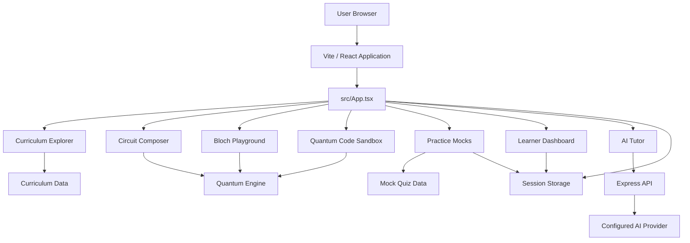

<div align="center">


# QubitLab

### An interactive platform for learning, building, visualizing, and experimenting with quantum computing.

[](https://react.dev/)
[](https://www.typescriptlang.org/)
[](https://vite.dev/)
[](https://threejs.org/)
[](https://expressjs.com/)

**[Architecture](#architecture)** · **[How it works](#how-it-works)** · **[Features](#features)** · **[Quick start](#quick-start)** · **[Contributing](#contributing)**

</div>

---

## Overview

QubitLab is an interactive quantum computing learning environment that combines structured curriculum content, circuit construction, quantum-state visualization, code exploration, practice assessments, learner progress, and AI-assisted explanations.

The application is designed around an interactive learning loop:

```
Learn → Build → Simulate → Visualize → Test → Improve
```

Instead of separating theory from experimentation, QubitLab connects concepts directly to interactive tools.

---

## Features

| Area | Capability |
|---|---|
| Curriculum | Structured modules covering quantum foundations, core concepts, gates, mathematics, and algorithms |
| Circuit Composer | Interactive construction and simulation of quantum circuits |
| Quantum Engine | Browser-side quantum state and gate simulation utilities |
| State Visualization | State-vector and measurement-oriented visual exploration |
| Bloch Sphere | Interactive 3D representation of single-qubit states |
| Code Sandbox | Exploration of quantum programming concepts and generated code |
| Multi-SDK Export | Circuit export support for Qiskit, PennyLane, Cirq, and OpenQASM |
| Practice Mocks | Five module-based mocks with 10 MCQs each |
| Learner Dashboard | Dynamic learning progress and assessment summaries |
| AI Tutor | Context-aware explanations for concepts, circuits, code, and quiz questions |

---

# How It Works

## 1. Learn through the curriculum

The learning experience is organized into five areas:

```
Quantum Foundations
        ↓
Core Concepts
        ↓
Gates & Circuits
        ↓
Quantum Mathematics
        ↓
Quantum Algorithms
```

Each area connects theory with interactive experimentation.

## 2. Build a circuit

The Circuit Composer allows users to construct circuits by placing quantum gates across qubit wires and time steps.

The application then sends the circuit representation through the internal quantum simulation utilities.

## 3. Inspect the result

The circuit output can be explored through:

- State-vector representations
- Measurement-oriented visualizations
- Bloch-sphere views for individual qubits
- Generated code for supported quantum frameworks

## 4. Practice with module mocks

Each major curriculum area has a dedicated practice mock containing **10 multiple-choice questions**.

The quiz system provides:

- Question-by-question interaction
- Immediate answer feedback
- Explanations
- Score calculation
- Best-score tracking during the active browser session

## 5. Ask for help

The AI tutor can receive context from different parts of the application, including:

- Quantum concepts
- Circuit analysis
- Generated code
- Debugging requests
- Quiz explanations

---

# Architecture

QubitLab uses a React-based feature architecture with shared types, structured data, reusable simulation utilities, and an Express server for API functionality.



## Frontend flow

```
index.html
    │
    ▼
src/main.tsx
    │
    ▼
src/App.tsx
    │
    ├── Navigation
    ├── Curriculum
    ├── Circuit Composer
    ├── Bloch Playground
    ├── Code Sandbox
    ├── Practice Mocks
    ├── Learner Dashboard
    └── AI Tutor
```

## Data and simulation flow

```
User interaction
      │
      ▼
React component state
      │
      ├── Curriculum / Quiz data
      │
      ├── Quantum circuit model
      │         │
      │         ▼
      │    Quantum Engine
      │         │
      │         ▼
      │    Visualizations / Code Export
      │
      └── Session Storage
                │
                ▼
       Restore state after reload
       within the active browser session
```

---

# Session Behavior

QubitLab intentionally uses **browser session storage** for learner interaction state.

This provides a practical balance between usability and privacy:

| Action | Behavior |
|---|---|
| Open a new browser session | Starts with fresh session data |
| Reload the application | Restores relevant in-session state |
| Continue a quiz after reload | Current attempt can be restored |
| Navigate between pages | Selected application state is retained |
| Close the browser session | Session-based data is cleared according to browser behavior |

Persistent user accounts and cross-device progress synchronization are not currently part of the application architecture.

---

# Project Structure

```text
Qubit_Lab/
│
├── docs/
│   └── assets/
│       └── qubitlab-banner.svg
│
├── public/
│
├── server/
│   └── index.ts                  # API and production/development server
│
├── src/
│   ├── components/
│   │   ├── bloch/                # Bloch sphere features
│   │   ├── chat/                 # AI tutor interface
│   │   ├── circuit/              # Circuit composition
│   │   ├── curriculum/           # Learning modules
│   │   ├── dashboard/            # Learner progress
│   │   ├── landing/              # Landing experience
│   │   ├── layout/               # Navigation and shared layout
│   │   ├── quiz/                 # Practice mock interface
│   │   ├── sandbox/              # Quantum code workspace
│   │   └── visualization/        # State visualization
│   │
│   ├── data/
│   │   ├── curriculum.ts         # Structured learning content
│   │   └── mockQuizzes.ts        # 5 module mocks, 10 MCQs each
│   │
│   ├── types/
│   │   └── quantum.ts            # Shared TypeScript models
│   │
│   ├── utils/
│   │   ├── progress.ts           # Session-based learner progress
│   │   └── quantumEngine.ts      # Quantum simulation utilities
│   │
│   ├── App.tsx                   # Application coordinator
│   ├── main.tsx                  # React entry point
│   └── index.css                 # Global styling
│
├── package.json
├── vite.config.ts
├── tsconfig.json
└── README.md
```

---

# Technology Stack

## Frontend

- React
- TypeScript
- Vite
- Tailwind CSS
- Motion

## Visualization

- Three.js
- WebGL through the browser graphics stack

## Backend

- Express
- tsx
- esbuild

## AI Integration

The server supports AI-assisted functionality through a server-side provider configuration.

The frontend does not need to contain private provider credentials.

---

# Quick Start

## Prerequisites

- Node.js 18 or newer
- npm

Verify your installation:

```bash
node --version
npm --version
```

## Clone

```bash
git clone https://github.com/chamanvashishth/Qubit_Lab.git
cd Qubit_Lab
```

## Install dependencies

```bash
npm install
```

## Configure optional server-side AI

AI functionality requires a provider credential configured **only in the server environment**.

Do not place real credentials in:

- README files
- frontend source files
- committed environment files
- client-side configuration

Use your deployment platform's environment-variable configuration or an untracked local environment file.

## Run locally

```bash
npm run dev
```

Open the local address printed by the development server.

---

# Available Commands

| Command | Purpose |
|---|---|
| `npm run dev` | Start development mode |
| `npm run lint` | Run TypeScript validation |
| `npm run build` | Build the frontend and server bundle |
| `npm run start` | Run the production server |
| `npm run clean` | Remove generated build output |

Recommended validation before deployment:

```bash
npm run lint
npm run build
```

---

# Deployment Model

The application runs as a combined frontend and server deployment:

```
Build
  │
  ├── Vite builds the React frontend
  │
  └── esbuild bundles the server entry
          │
          ▼
      Production server
          │
          ├── Serves static frontend
          └── Handles API requests
```

For production deployment:

1. Configure the required server environment variables in the hosting platform.
2. Build the project.
3. Start the production server.
4. Verify the health/API and browser application.

Never expose provider credentials through the client bundle.

---

# Security

This repository should not contain secrets or private operational data.

Before pushing changes, verify that you are not committing:

- API keys
- Access tokens
- Passwords
- Private URLs
- Database credentials
- Personal contact information
- Production configuration files containing secrets

Recommended practices:

```text
Source code        → Git repository
Public assets      → Git repository
Environment values → Hosting platform / local untracked configuration
Secrets            → Never committed
```

If a credential is accidentally committed, removing it from the README or source file is not sufficient. The credential should be revoked or rotated.

---

# Development Principles

- Keep components focused on a clear responsibility.
- Keep structured content separate from presentation code.
- Reuse simulation and utility logic rather than duplicating it.
- Prefer simple, maintainable solutions over unnecessary abstractions.
- Validate TypeScript and production builds before deployment.
- Do not introduce persistent user data unless the product explicitly requires it.
- Keep secrets server-side.

---

# Contributors

- [@chamanvashishth](https://github.com/chamanvashishth)
- [@asharma975565-ship-it](https://github.com/asharma975565-ship-it)
- [@hellovneet](https://github.com/hellovneet)
- [@mehfa1](https://github.com/mehfa1)
- [@narayankr03-gif](https://github.com/narayankr03-gif)

---

# Contributing

1. Fork the repository.
2. Create a focused branch.

```bash
git checkout -b feature/your-change
```

3. Implement one coherent change.
4. Validate it.

```bash
npm run lint
npm run build
```

5. Review the diff and ensure no secrets are included.
6. Commit with a clear message.
7. Open a pull request describing:
   - What changed
   - Why it changed
   - How it was tested

---

# Roadmap

Potential future directions include:

- Persistent authenticated learner profiles
- Cross-device progress synchronization
- Additional quantum algorithms
- Expanded circuit simulation capabilities
- More practice and challenge modes
- Additional visualizations
- Improved SDK interoperability
- Automated testing coverage

---

# License

No explicit license is currently defined in the repository.

Before public distribution as an open-source project, add a license file that defines usage, modification, and distribution rights.

---

<div align="center">

Built for interactive quantum computing exploration.

**Learn · Build · Simulate · Visualize · Test**

[Back to top](#qubitlab)

</div>
