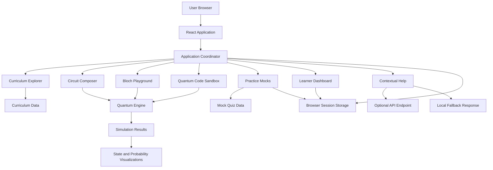
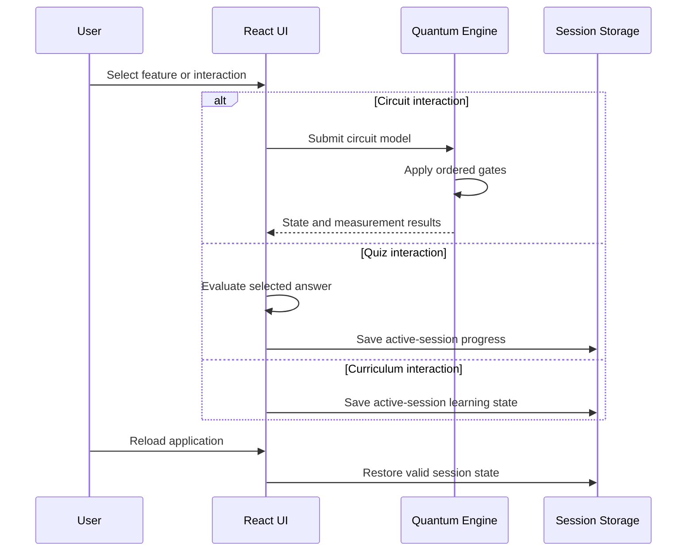
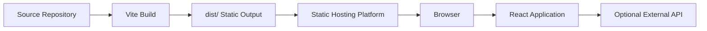

<div align="center">


# QubitLab

### An interactive quantum computing platform for learning, building, simulating, visualizing, and practicing quantum concepts.

[](https://react.dev/)
[](https://www.typescriptlang.org/)
[](https://vite.dev/)
[](https://threejs.org/)

[Live Application](#live-application) · [Architecture](#architecture) · [Features](#features) · [Getting Started](#getting-started) · [Contributing](#contributing)

</div>

---

## Overview

QubitLab is a browser-based quantum computing learning environment that connects theory with experimentation.

The platform combines a structured curriculum, an interactive circuit composer, a client-side quantum simulator, Bloch-sphere visualization, quantum code exploration, practice mocks, and session-based learner progress.

The central learning workflow is:

```
Learn
  ↓
Build
  ↓
Simulate
  ↓
Visualize
  ↓
Practice
  ↓
Improve
```

The objective is simple: reduce the gap between reading about quantum computing and actively experimenting with it.

---

## Live Application

The project is deployed as a Vite-based web application.

The deployment URL is intentionally not hardcoded in this README. This avoids coupling repository documentation to a temporary or environment-specific domain.

---

# Features

| Area | Capability |
|---|---|
| Curriculum | Structured learning across quantum foundations, concepts, gates, mathematics, and algorithms |
| Circuit Composer | Interactive quantum circuit construction |
| Quantum Engine | Client-side state-vector simulation utilities |
| State Analysis | Probabilities, amplitudes, phases, Dirac notation, and shot histograms |
| Bloch Visualization | Interactive single-qubit state exploration |
| Code Sandbox | Exploration of generated quantum code |
| SDK Export | Qiskit, PennyLane, Cirq, and OpenQASM export |
| Practice Mocks | Module-based MCQs with explanations and scoring |
| Learner Dashboard | Session-based progress and learning summaries |
| Contextual Help | Optional assistant interface with local fallback behavior |

---

# How QubitLab Works

## 1. Learn

The curriculum is organized into progressive areas:

```
Quantum Foundations
        ↓
Core Concepts
        ↓
Gates and Circuits
        ↓
Quantum Mathematics
        ↓
Quantum Algorithms
```

Content is separated from the UI so learning material can be updated without restructuring core components.

---

## 2. Build

The Circuit Composer lets users place operations across:

- Qubit wires
- Circuit time steps
- Controlled operations
- Multi-qubit operations

The placement system validates wire occupancy to reduce invalid overlaps between operations.

---

## 3. Simulate

Circuit data is passed to the internal quantum engine:

```
Circuit Model
      ↓
Gate Ordering
      ↓
State-Vector Operations
      ↓
Probability Calculation
      ↓
Shot Sampling
      ↓
Simulation Result
```

The simulator currently operates in the browser and is intentionally constrained to a small number of qubits for practical client-side performance.

---

## 4. Visualize

Simulation results can be explored through:

- Basis-state probabilities
- Complex amplitudes
- Relative phase information
- Dirac notation
- Measurement shot histograms
- Bloch vectors for individual qubits

For multi-qubit systems, reduced single-qubit information is used for Bloch-style visualization.

---

## 5. Practice

Practice mocks are connected to the learning modules.

The quiz system supports:

- Multiple-choice questions
- Immediate interaction and feedback
- Explanations
- Score calculation
- Best-score tracking during the browser session

The UI also protects against stale session state when quiz content changes.

---

# Architecture

## High-Level Architecture



---

## Application Workflow



---

# Project Structure

```text
Qubit_Lab/
│
├── docs/
│   └── assets/
│       └── qubitlab-banner.svg
│
├── public/
│
├── server/
│   └── index.ts
│
├── src/
│   ├── components/
│   │   ├── bloch/          # Bloch visualization
│   │   ├── chat/           # Contextual help interface
│   │   ├── circuit/        # Circuit construction
│   │   ├── curriculum/     # Learning experience
│   │   ├── dashboard/      # Learner progress
│   │   ├── landing/        # Landing experience
│   │   ├── layout/         # Navigation and shared layout
│   │   ├── quiz/           # Practice mocks
│   │   ├── sandbox/        # Quantum code exploration
│   │   └── visualization/  # Simulation visualization
│   │
│   ├── data/
│   │   ├── curriculum.ts
│   │   └── mockQuizzes.ts
│   │
│   ├── types/
│   │   └── quantum.ts
│   │
│   ├── utils/
│   │   ├── progress.ts
│   │   └── quantumEngine.ts
│   │
│   ├── App.tsx
│   ├── main.tsx
│   └── index.css
│
├── package.json
├── vite.config.ts
├── vercel.json
└── README.md
```

---

# Technology Stack

## Frontend

- React
- TypeScript
- Vite
- Tailwind CSS
- Motion

## Visualization

- Three.js
- Browser WebGL capabilities

## Simulation

The internal quantum engine handles:

- Single-qubit gates
- Controlled operations
- SWAP operations
- Toffoli operations
- State-vector evolution
- Probability calculation
- Monte Carlo measurement sampling

## Code Interoperability

QubitLab can generate representations for:

- Qiskit
- PennyLane
- Cirq
- OpenQASM

Generated code is intended as an educational starting point and should be validated in the target SDK environment before production use.

---

# Session and Data Behavior

QubitLab uses browser session storage for selected learning state and progress.

| Action | Behavior |
|---|---|
| Open a new browser session | Starts with fresh session data |
| Reload the application | Restores relevant valid session state |
| Navigate between features | Preserves active-session interaction |
| Close the session | Browser-managed session data is cleared according to browser behavior |

The project does not currently implement:

- User authentication
- Cross-device synchronization
- Persistent cloud profiles

This keeps the default learning experience lightweight and avoids requiring users to create an account.

---

# Getting Started

## Prerequisites

- Node.js 18 or newer
- npm

Check your environment:

```bash
node --version
npm --version
```

## Clone the repository

```bash
git clone https://github.com/chamanvashishth/Qubit_Lab.git
cd Qubit_Lab
```

## Install dependencies

```bash
npm install
```

## Run locally

```bash
npm run dev
```

Open the local URL printed by the development server.

---

# Available Commands

| Command | Purpose |
|---|---|
| `npm run dev` | Start local development mode |
| `npm run lint` | Run TypeScript validation |
| `npm run build` | Build the Vite frontend |
| `npm run build:server` | Build the frontend and server bundle |
| `npm run start` | Run the bundled production server |
| `npm run clean` | Remove generated build output |

Recommended validation:

```bash
npm run lint
npm run build
```

---

# Deployment Architecture

The current frontend deployment is designed for static Vite-compatible hosting.



The repository includes `vercel.json` for Vercel-compatible static deployment and SPA routing.

The application uses root asset paths for normal deployments while retaining support for a repository subpath when built inside the configured GitHub Actions environment.

---

# Security and Repository Hygiene

This README intentionally excludes:

- API keys
- Access tokens
- Passwords
- Private credentials
- Personal contact information
- Secret environment values
- Private operational endpoints

Recommended separation:

```text
Application source      → Git repository
Public assets           → Git repository
Environment configuration → Hosting platform or untracked local environment
Secrets                 → Never committed
```

If a credential is accidentally committed, deleting it from the source is not sufficient. The credential should be revoked or rotated.

---

# Development Principles

The project follows several practical engineering principles:

- Keep components focused on clear responsibilities.
- Keep curriculum and quiz content separate from presentation.
- Reuse simulation logic rather than duplicating it.
- Validate persisted browser data before rendering.
- Prefer simple solutions over unnecessary abstraction.
- Keep secrets outside the client bundle.
- Treat generated SDK code as exportable learning material, not automatically production-ready code.

---

# Known Scope Boundaries

To keep the browser-based simulator practical, QubitLab is not intended to replace large-scale quantum simulation infrastructure.

The current implementation is most suitable for:

- Learning quantum foundations
- Experimenting with small circuits
- Visualizing state evolution
- Understanding gates and entanglement
- Practicing conceptual knowledge

Large state-vector simulations grow exponentially with qubit count and require a different computational architecture.

---

# Roadmap

Potential future improvements include:

- Persistent learner profiles
- Cross-device progress synchronization
- Native serverless API integration
- Additional algorithms and circuit templates
- Expanded challenge modes
- Automated unit and integration tests
- Broader SDK interoperability
- More advanced visualization modes

---

# Contributors

- [@chamanvashishth](https://github.com/chamanvashishth)
- [@asharma975565-ship-it](https://github.com/asharma975565-ship-it)
- [@hellovneet](https://github.com/hellovneet)
- [@mehfa1](https://github.com/mehfa1)
- [@narayankr03-gif](https://github.com/narayankr03-gif)

---

# Contributing

1. Fork the repository.
2. Create a focused branch.

```bash
git checkout -b feature/your-change
```

3. Make one coherent change.
4. Validate the project.

```bash
npm run lint
npm run build
```

5. Review your changes and verify that no secrets are included.
6. Commit with a descriptive message.
7. Open a pull request explaining:

   - What changed
   - Why it changed
   - How it was validated

---

# License

No explicit license file is currently present in the repository.

Before treating the project as an open-source project with defined reuse rights, add an appropriate license.

---

<div align="center">

Built for hands-on quantum computing exploration.

**Learn · Build · Simulate · Visualize · Practice**

</div>
