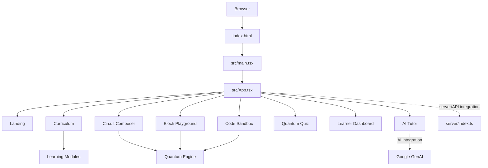

<div align="center">


# QubitLab

### Learn quantum computing by building, visualizing, experimenting, and asking questions.

[](https://react.dev/)
[](https://www.typescriptlang.org/)
[](https://vite.dev/)
[](https://threejs.org/)
[](https://expressjs.com/)
[](https://ai.google.dev/)

**[Explore the architecture](#architecture)** · **[Get started](#quick-start)** · **[Features](#features)** · **[Contribute](#contributing)**

</div>

---

## What is QubitLab?

**QubitLab** is an interactive quantum computing learning and experimentation platform. It brings together structured learning content, circuit composition, state visualization, a 3D Bloch sphere, code exploration, quizzes, a learner dashboard, and an AI-assisted tutor.

The project is built around one practical idea:

> **Quantum computing is easier to understand when theory and experimentation happen together.**

### The learning loop

```
Learn  →  Build  →  Visualize  →  Experiment  →  Test  →  Learn again
```

Instead of treating quantum computing as only mathematics or only programming, QubitLab connects concepts to interactive tools.

---

## Contents

- [Features](#features)
- [How QubitLab works](#how-qubitlab-works)
- [Architecture](#architecture)
- [Project structure](#project-structure)
- [Technology stack](#technology-stack)
- [Quick start](#quick-start)
- [Environment configuration](#environment-configuration)
- [Available commands](#available-commands)
- [Development workflow](#development-workflow)
- [Collaborators](#collaborators)
- [Security](#security)
- [Roadmap](#roadmap)
- [Contributing](#contributing)

---

# Features

| Area | What it provides |
|---|---|
| **Curriculum** | Structured learning content covering foundations, concepts, mathematics, and algorithms. |
| **Circuit Composer** | An interactive workspace for building and exploring quantum circuits. |
| **3D Bloch Sphere** | Visual exploration of qubit states and their geometric representation. |
| **State Visualization** | Tools for inspecting and understanding quantum state representations. |
| **Quantum Sandbox** | A dedicated environment for experimenting with quantum code and ideas. |
| **AI Tutor** | Context-aware assistance for concepts, circuits, code explanations, debugging, and quiz help. |
| **Quantum Quiz** | Knowledge checks to reinforce concepts through assessment. |
| **Learner Dashboard** | A central interface for navigating the learning experience. |

---

# How QubitLab Works

## 1. Start with a concept

The **Curriculum Explorer** organizes learning into four primary areas:

```text
Quantum Foundations
        ↓
Core Concepts
        ↓
Mathematical Foundations
        ↓
Quantum Algorithms
```

This gives learners a structured path instead of forcing them to jump directly into advanced circuits or code.

## 2. Build and experiment

After learning a concept, the **Circuit Composer** provides a practical environment for exploring quantum operations.

Users can connect theory to circuit behavior rather than treating gates as isolated syntax.

## 3. Visualize the state

Quantum systems are difficult to reason about from equations alone. QubitLab therefore includes visual tools such as:

- Bloch-sphere exploration
- State-vector visualization
- Interactive quantum representations

## 4. Explore through code

The **Quantum Code Sandbox** provides a separate space for working with quantum-programming ideas.

The AI assistant can be used to explain or inspect supported code interactions within the application.

## 5. Test understanding

The **Quantum Quiz** provides assessment and AI-assisted help, completing the learning cycle:

```
Concept → Experiment → Visualization → Assessment
```

---

# Architecture

QubitLab uses a feature-oriented frontend architecture with shared data, types, and quantum utilities separated from presentation components.



### Application entry flow

```text
index.html
    │
    ▼
src/main.tsx
    │
    ▼
src/App.tsx
    │
    ├── Landing
    ├── Curriculum
    ├── Circuit Composer
    ├── Bloch Playground
    ├── Quantum Sandbox
    ├── Quiz
    ├── Dashboard
    └── AI Tutor
```

---

# Project Structure

```text
Qubit_Lab/
│
├── docs/
│   └── assets/
│       └── qubitlab-banner.svg     # README visual identity
│
├── public/                         # Static assets
│
├── server/
│   └── index.ts                    # Server/API entry point
│
├── src/
│   ├── components/
│   │   ├── bloch/                  # Bloch sphere and qubit geometry
│   │   ├── chat/                   # AI tutor interface
│   │   ├── circuit/                # Circuit composition
│   │   ├── curriculum/             # Learning experience
│   │   │   └── modules/            # Foundations, concepts, math, algorithms
│   │   ├── dashboard/              # Learner dashboard
│   │   ├── landing/                # Landing experience
│   │   ├── layout/                 # Shared layout and navigation
│   │   ├── quiz/                   # Assessment experience
│   │   ├── sandbox/                # Quantum code workspace
│   │   └── visualization/          # Quantum state visualization
│   │
│   ├── data/
│   │   └── curriculum.ts           # Structured curriculum data
│   │
│   ├── types/
│   │   └── quantum.ts              # Shared quantum TypeScript types
│   │
│   ├── utils/
│   │   └── quantumEngine.ts        # Quantum simulation utilities
│   │
│   ├── App.tsx                     # Application coordinator
│   ├── main.tsx                    # React entry point
│   └── index.css                   # Global styles
│
├── index.html
├── package.json
├── tsconfig.json
├── vite.config.ts
└── README.md
```

---

# Technology Stack

### Frontend

- **React 19** — UI and component architecture
- **TypeScript** — Static typing
- **Vite** — Development and build tooling
- **Tailwind CSS** — Styling
- **Motion** — Interface animation

### Visualization

- **Three.js** — 3D rendering and Bloch-sphere visualization
- **WebGL** — Browser-side graphics through the visualization stack

### Backend and Tooling

- **Express** — Server-side/API functionality
- **tsx** — TypeScript runtime tooling
- **esbuild** — Production server bundling

### AI

- **Google GenAI** — AI-assisted learning integration

---

# Quick Start

## Prerequisites

You need:

- **Node.js 18+** recommended
- **npm**

Verify your installation:

```bash
node --version
npm --version
```

---

## Step 1 — Clone the repository

```bash
git clone https://github.com/chamanvashishth/Qubit_Lab.git
cd Qubit_Lab
```

## Step 2 — Install dependencies

```bash
npm install
```

## Step 3 — Configure the environment

Create your local environment configuration and provide the required AI key:

```env
GEMINI_API_KEY=your_api_key_here
```

If AI-assisted functionality is not configured, features depending on that key may not work.

## Step 4 — Start development mode

```bash
npm run dev
```

Open the local URL printed in the terminal.

## Step 5 — Validate TypeScript

```bash
npm run lint
```

## Step 6 — Create a production build

```bash
npm run build
```

---

# Environment Configuration

| Variable | Purpose | Required for |
|---|---|---|
| `GEMINI_API_KEY` | Google GenAI authentication | AI-assisted features |

### Important

Never commit secrets to the repository.

Do **not** publish:

- API keys
- Access tokens
- Passwords
- Private credentials
- Production secrets

---

# Available Commands

| Command | Purpose |
|---|---|
| `npm run dev` | Start the development server |
| `npm run lint` | Run TypeScript validation |
| `npm run build` | Build the frontend and production server bundle |
| `npm run start` | Run the production server |
| `npm run clean` | Remove generated build output |

---

# Development Workflow

A focused workflow for contributors:

```text
1. Pull the latest changes
          ↓
2. Create a focused branch
          ↓
3. Implement one coherent change
          ↓
4. Run validation
          ↓
5. Review the diff
          ↓
6. Commit clearly
          ↓
7. Open a pull request
```

### Engineering principles

- Prefer understandable code over clever abstractions.
- Avoid unnecessary dependencies.
- Keep features grouped by domain.
- Keep reusable logic separate from UI where practical.
- Make focused changes rather than broad unrelated rewrites.
- Validate before pushing.

The goal is not the fewest lines of code. The goal is **the simplest structure that remains maintainable**.

---

# Collaborators

QubitLab is maintained with collaboration from the following repository members:

| Collaborator | GitHub Username | Role |
|---|---|---|
| **Chaman Vashishth** | [@chamanvashishth](https://github.com/chamanvashishth) | Project Owner and Maintainer |
| **asharma975565-ship-it** | [@asharma975565-ship-it](https://github.com/asharma975565-ship-it) | Collaborator |
| **Vineet Sharma** | [@hellovneet](https://github.com/hellovneet) | Collaborator |
| **mehfa1** | [@mehfa1](https://github.com/mehfa1) | Collaborator |
| **Narayan Kr** | [@narayankr03-gif](https://github.com/narayankr03-gif) | Collaborator |

> GitHub collaborator access and commit attribution are different. This section identifies the collaborators provided in the repository collaboration context.

---

# Security

Before pushing changes:

- Check that no secret is embedded in source code.
- Keep environment files out of version control.
- Do not expose private keys through frontend bundles.
- Review staged changes before committing.
- Rotate any credential that is accidentally published.

---

# Roadmap

Potential directions for future development:

- [ ] Additional quantum algorithms and experiments
- [ ] More circuit operations and simulation capabilities
- [ ] Expanded learning paths
- [ ] Persistent learner progress
- [ ] User authentication and profiles
- [ ] Additional assessment and challenge modes
- [ ] More visualization tools
- [ ] Broader interoperability with quantum SDK ecosystems

---

# Contributing

Contributions are welcome.

1. **Fork** the repository.
2. Create a branch:

   ```bash
   git checkout -b feature/your-feature
   ```

3. Make focused changes.
4. Validate the project:

   ```bash
   npm run lint
   npm run build
   ```

5. Commit with a meaningful message:

   ```bash
   git commit -m "feat: describe the change"
   ```

6. Push your branch and open a pull request.

### Pull request expectations

A good pull request should explain:

- What changed
- Why it changed
- Which area of the application is affected
- How the change was validated

---

# License

A license file is not currently defined in the repository.

Before formally distributing QubitLab as an open-source project, add an explicit license defining usage, modification, and distribution rights.

---

<div align="center">

### Built for interactive quantum computing exploration.

**Learn · Build · Visualize · Experiment**

[Back to top](#qubitlab)

</div>
