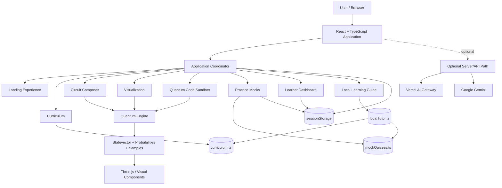
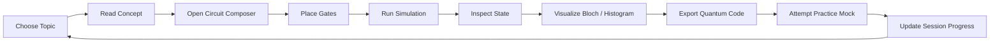
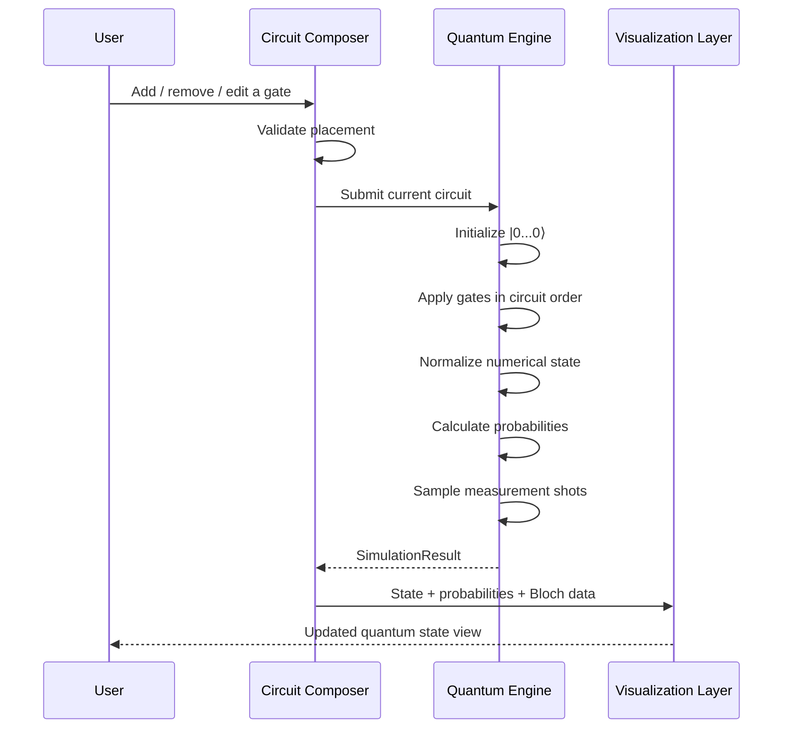
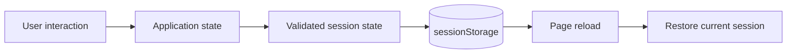
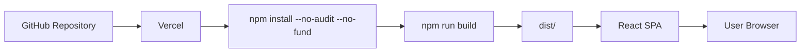

<div align="center">


# QubitLab

### Learn quantum computing by building the circuit, simulating the state, visualizing the result, and testing what you learned.

[](https://react.dev/)
[](https://www.typescriptlang.org/)
[](https://vite.dev/)
[](https://threejs.org/)
[](https://tailwindcss.com/)
[](https://vercel.com/)

[Overview](#overview) · [Features](#features) · [Architecture](#architecture) · [Quantum Engine](#quantum-engine) · [Getting Started](#getting-started) · [Deployment](#deployment) · [Contributing](#contributing)

</div>

---

## Overview

**QubitLab** is a browser-based quantum computing learning environment designed to make quantum concepts executable rather than purely theoretical.

Instead of separating lessons, circuit construction, simulation, visualization, and assessment into disconnected tools, QubitLab brings them into one learning loop:

```text
┌────────────┐
│    LEARN   │  Understand the concept
└─────┬──────┘
      ↓
┌────────────┐
│    BUILD   │  Compose a quantum circuit
└─────┬──────┘
      ↓
┌────────────┐
│  SIMULATE  │  Evolve the statevector
└─────┬──────┘
      ↓
┌────────────┐
│ VISUALIZE  │  Inspect amplitudes & outcomes
└─────┬──────┘
      ↓
┌────────────┐
│  PRACTICE  │  Test the concept with mocks
└─────┬──────┘
      ↓
     IMPROVE
```

The platform is intentionally lightweight: the primary simulator and learning assistant run in the browser, while an optional server/API path remains available for deployments that need model-backed assistance.

---

## Product Goals

QubitLab is built around five practical goals:

1. **Make quantum computing interactive** — users should be able to change a circuit and immediately inspect the consequences.
2. **Connect mathematics to behavior** — statevectors, amplitudes, probabilities, phase, and Dirac notation are presented alongside circuit operations.
3. **Keep learning content structured** — curriculum and mock-quiz data live separately from presentation components.
4. **Keep the default experience dependency-light** — the local guide does not require an API key or a network request.
5. **Make the project deployable and maintainable** — Vite/Vercel deployment is documented explicitly, with secrets kept outside source control.

---

# Features

### Learning

- Structured quantum-computing curriculum
- Progressive foundations, concepts, gates/circuits, mathematics, and algorithms
- Learning objectives and prerequisites per topic
- Topic-aware learner flow

### Circuit Composer

- Interactive multi-qubit circuit construction
- Configurable **1–5 qubits**
- Configurable **4–12 circuit steps**
- Single-qubit gates: `H`, `X`, `Y`, `Z`, `S`, `T`, `Rx`, `Ry`, `Rz`
- Dagger gates: `S†`, `T†`
- Controlled operations: `CNOT`, `CZ`
- Multi-qubit operations: `SWAP`, `CCNOT`
- Measurement markers
- Collision/placement validation for multi-qubit gates
- Circuit presets including Bell, GHZ, Superposition, Grover, Deutsch, and Teleportation
- Step-by-step circuit scrubbing
- Clear/reset controls

### Quantum Simulation

- Client-side statevector simulation
- Complex-number arithmetic
- Gate-by-gate state evolution
- Probability calculation from amplitudes
- Measurement-shot sampling
- Numerical state normalization
- Bloch-vector extraction for individual qubits
- Dirac/bra-ket state formatting
- Entanglement-aware result inspection

### Visualization

- Statevector/amplitude visualization
- Measurement histograms
- Dirac notation
- Single-qubit Bloch-sphere visualization
- Interactive 3D visualization through Three.js/WebGL

### Quantum Code Export

Generate educational circuit representations for:

- **Qiskit**
- **PennyLane**
- **Cirq**
- **OpenQASM**

Generated snippets are intended as learning/export material and should be validated against the target SDK/version before production use.

### Practice & Progress

- Module-based multiple-choice mocks
- Immediate answer feedback
- Explanations and scoring
- Best-score tracking during the active browser session
- Session-based learner progress
- Dashboard summaries driven by the current learning state

### Local Learning Guide

The default in-app guide is deliberately **offline-first**:

- Uses the built-in curriculum and quiz knowledge as its primary learning corpus
- Performs local keyword/topic retrieval
- Includes a compact general technical knowledge base
- Handles common quantum concepts, gates, algorithms, mathematics, programming, science, and technology questions within its built-in knowledge scope
- Adds a small deterministic math evaluator for supported expressions
- Does not require an API key
- Does not make a request to `/api/chat` from the current tutor UI

> The local guide is a deterministic retrieval/knowledge system, not a full generative LLM. It therefore does **not** truthfully provide unlimited world knowledge. Its advantage is predictable, fast, offline behavior grounded in the application's own educational material.

---

# Visual System

QubitLab uses a dark, technical visual language built around glass surfaces, fine borders, high-contrast typography, and electric accent lighting.

The repository includes a dedicated visual banner at `docs/assets/qubitlab-banner.svg`, used as the README hero graphic.

The application UI follows the same general direction:

```text
Dark surface
    +
Glass panels
    +
Fine white borders
    +
Lime / amber accents
    +
3D quantum visualization
    =
QubitLab visual language
```

---

# Architecture

## High-Level System Architecture



### Architectural boundaries

| Layer | Responsibility |
|---|---|
| `src/components` | User-facing feature components and presentation |
| `src/data` | Curriculum and mock-quiz knowledge |
| `src/types` | Shared TypeScript domain models |
| `src/utils/quantumEngine.ts` | Quantum state manipulation and simulation |
| `src/utils/localTutor.ts` | Offline educational retrieval and deterministic responses |
| `src/utils/progress.ts` | Session-based learner progress |
| `api/chat.ts` | Optional model-backed HTTP endpoint |
| `server/index.ts` | Optional Express/Vite server path |
| `vercel.json` | Vercel build and SPA routing configuration |

---

# Learning Workflow



This is the core product loop: **concept → experiment → observation → assessment**.

---

# Circuit Simulation Workflow



Every circuit edit is therefore treated as a new simulation state rather than a static diagram.

---

# Quantum Engine

The simulation core lives in `src/utils/quantumEngine.ts`.

## Supported operations

| Category | Operations |
|---|---|
| Basic gates | `H`, `X`, `Y`, `Z` |
| Phase gates | `S`, `S†`, `T`, `T†` |
| Rotations | `Rx(θ)`, `Ry(θ)`, `Rz(θ)` |
| Controlled gates | `CNOT`, `CZ` |
| Multi-qubit gates | `SWAP`, `CCNOT` |
| Analysis | Probabilities, amplitudes, phases, Bloch vectors |
| Measurement | Shot sampling and histogram generation |
| Export | Qiskit, PennyLane, Cirq, OpenQASM |

### Important numerical behavior

The engine uses complex amplitudes and applies gates directly to the statevector. Rotation matrices use the standard half-angle convention; for example:

```text
Rx(θ) = cos(θ/2) I - i sin(θ/2) X
```

After simulation, the state is numerically normalized to limit floating-point drift.

Measurement is represented separately from the unitary evolution used for the pre-measurement state, allowing the UI to inspect the circuit state while also producing sampled measurement outcomes.

---

# Data & State Model

QubitLab keeps educational data separate from UI code.

```text
src/data/
├── curriculum.ts      → topics, objectives, prerequisites
└── mockQuizzes.ts     → practice questions and explanations
```

Runtime learner state is intentionally session-scoped:



| Event | Behavior |
|---|---|
| Navigate within the app | Current learning state remains available |
| Reload page | Valid session state is restored |
| Start a new browser session | Learning state starts fresh |
| Close browser/session | Data follows normal browser `sessionStorage` lifecycle |
| Cloud account login | Not currently implemented |
| Cross-device sync | Not currently implemented |

This is a deliberate product boundary, not a hidden persistence layer.

---

# Project Structure

```text
Qubit_Lab/
│
├── api/
│   └── chat.ts                 # Optional model-backed API endpoint
│
├── docs/
│   └── assets/
│       └── qubitlab-banner.svg # README / project visual
│
├── server/
│   └── index.ts                # Optional Express + Vite server
│
├── src/
│   ├── components/
│   │   ├── bloch/              # Bloch-sphere visualization
│   │   ├── chat/               # Local learning guide UI
│   │   ├── circuit/             # Circuit composer
│   │   ├── curriculum/          # Curriculum experience
│   │   ├── dashboard/           # Learner dashboard
│   │   ├── landing/             # Landing experience
│   │   ├── layout/              # Navigation and shared layout
│   │   ├── quiz/                # Practice mocks
│   │   ├── sandbox/             # Quantum code exploration
│   │   └── visualization/       # State/probability visualization
│   │
│   ├── data/
│   │   ├── curriculum.ts        # Learning corpus
│   │   └── mockQuizzes.ts       # Quiz corpus
│   │
│   ├── types/
│   │   └── quantum.ts           # Domain types
│   │
│   ├── utils/
│   │   ├── localTutor.ts        # Offline tutor/retrieval logic
│   │   ├── progress.ts           # Session progress
│   │   └── quantumEngine.ts      # Simulation core
│   │
│   ├── App.tsx
│   ├── main.tsx
│   └── index.css
│
├── index.html
├── metadata.json
├── package.json
├── bun.lock
├── tsconfig.json
├── vercel.json
├── vite.config.ts
└── README.md
```

---

# Technology Stack

| Technology | Role |
|---|---|
| **React 19** | Component-based UI |
| **TypeScript 5.8** | Type-safe application logic |
| **Vite 6** | Development server and frontend build |
| **Tailwind CSS 4** | Utility-first styling |
| **Motion** | UI animation and interaction |
| **Three.js** | 3D quantum visualization |
| **Lucide React** | Interface icons |
| **Express** | Optional server runtime |
| **Google GenAI** | Optional server-side Gemini integration |
| **Vercel** | Target deployment platform |

---

# Getting Started

## Prerequisites

- Node.js 18+
- npm

Verify your environment:

```bash
node --version
npm --version
```

## Clone

```bash
git clone https://github.com/chamanvashishth/Qubit_Lab.git
cd Qubit_Lab
```

## Install

```bash
npm install
```

## Start development

```bash
npm run dev
```

Open the local URL printed by Vite.

---

# Available Commands

| Command | What it does |
|---|---|
| `npm run dev` | Starts the Vite development server |
| `npm run lint` | Runs TypeScript type-checking with `tsc --noEmit` |
| `npm run build` | Builds the Vite frontend into `dist/` |
| `npm run start` | Previews the built Vite application with `vite preview` |
| `npm run build:server` | Builds the frontend and bundles `server/index.ts` with esbuild |
| `npm run clean` | Removes the `dist/` directory |

Recommended local validation:

```bash
npm run lint
npm run build
```

---

# Deployment

## Vercel is the canonical deployment path

The repository includes `vercel.json` configured for a Vite application:



The Vercel configuration also rewrites non-API routes to `index.html`, which is required for client-side SPA navigation.

### Deploy from GitHub

1. Import `chamanvashishth/Qubit_Lab` into Vercel.
2. Keep the framework as **Vite**.
3. Use the repository build configuration supplied by `vercel.json`.
4. Deploy from the desired branch.
5. Vercel will rebuild when the connected branch receives a new commit.

### GitHub Pages

GitHub Pages is **not** the deployment target for the current project. The previous Pages-specific workflow/configuration was removed so the repository does not maintain two competing deployment paths.

---

# Optional AI API Path

The frontend tutor currently runs locally and does not depend on the remote AI endpoint.

The repository nevertheless retains `api/chat.ts` for optional model-backed use cases. That endpoint can use either:

- `AI_GATEWAY_API_KEY` with the Vercel AI Gateway, or
- a valid `GEMINI_API_KEY` for direct Gemini access.

The API implementation intentionally distinguishes these credentials and does not treat a Vercel deployment identity token as an AI provider credential.

If you do not need server-side model inference, no AI credential is required for the default local tutor experience.

### Optional environment variables

```text
AI_GATEWAY_API_KEY=...
AI_GATEWAY_MODEL=google/gemini-2.5-flash
GEMINI_API_KEY=...
GEMINI_MODEL=gemini-2.5-flash
```

**Never commit real credentials to Git.** Configure them through the deployment platform or an untracked local environment file.

---

# Debug & Engineering Hardening Reflected in This Version

This README documents the current architecture after the recent debugging and cleanup work.

### Removed / retired

- Removed the obsolete **GitHub Pages deployment workflow**.
- Removed documentation that implied GitHub Pages was the active deployment route.
- Removed the frontend tutor's dependency on `/api/chat` for normal operation.
- Removed the need for a client-side AI credential just to open and use the learning guide.
- Removed static assumptions in the circuit composer that limited it to one fixed circuit shape.

### Added / corrected

- Added an **offline local tutor** grounded in the application's syllabus and quiz corpus.
- Added deterministic local knowledge retrieval and supported math handling.
- Added live circuit re-simulation after circuit edits.
- Added dynamic qubit/step controls and multi-qubit gate placement validation.
- Added correct `Rx`, `Ry`, and `Rz` matrix handling and dagger gates.
- Added controlled, SWAP, and Toffoli simulation paths.
- Added numerical state normalization after simulation.
- Added measurement sampling, histograms, Bloch-vector analysis, and Dirac notation support.
- Added Qiskit, PennyLane, Cirq, and OpenQASM export paths.
- Added session-based progress persistence and validation.
- Added a dedicated repository visual asset and architecture/workflow documentation.
- Kept the optional API path provider-aware so Gateway and Gemini credentials are handled separately.

> The documentation intentionally distinguishes the **default local learning experience** from the **optional model-backed API**. This prevents deployment/setup instructions from implying that an API key is required when it is not.

---

# Security & Repository Hygiene

QubitLab should keep source code and credentials strictly separated.

```text
Source code                 → Git repository
Public visual assets        → Git repository
Local configuration         → Untracked environment file
Deployment secrets          → Vercel / hosting environment variables
API credentials             → Never commit
```

If a credential is accidentally committed, removing the line from Git is not enough. Revoke/rotate the exposed credential first, then clean the repository history if required.

The README intentionally does not contain real secrets, tokens, private endpoints, or deployment credentials.

---

# Scope & Performance Boundaries

QubitLab's simulator is designed for **interactive educational circuits**, not large-scale quantum simulation.

A statevector for `n` qubits contains `2^n` complex amplitudes, so memory and computation grow exponentially with the number of qubits.

The UI therefore exposes a deliberately small circuit size suitable for browser-based experimentation.

For larger simulations, the architecture would need a different computational backend, such as optimized native simulation, distributed execution, or an actual quantum-computing service.

---

# Known Product Boundaries

The current project does **not** provide:

- User authentication
- Cloud learner accounts
- Cross-device progress synchronization
- A database-backed profile system
- Unlimited general-purpose LLM knowledge in the offline tutor
- Hardware execution on a physical quantum processor

These are product boundaries, not undocumented assumptions.

---

# Roadmap

Possible next-stage improvements:

- Persistent learner profiles and authentication
- Cloud-synced progress
- More curriculum modules and advanced algorithms
- Larger practice banks and adaptive difficulty
- Automated unit/integration tests for the simulator
- More comprehensive circuit validation
- Additional quantum SDK exports
- Optional model-backed tutor with explicit provider configuration
- Hardware execution integrations for supported quantum platforms
- Accessibility and keyboard-first circuit editing improvements

---

# Contributing

Contributions are welcome when they improve correctness, learning value, usability, or maintainability.

### Development flow

```bash
git checkout -b feature/your-change
npm install
npm run lint
npm run build
```

Then:

1. Make one focused change.
2. Keep quantum logic changes isolated from UI changes where practical.
3. Validate circuit behavior for representative cases such as `|0⟩`, `|1⟩`, `H`, Bell, and controlled operations.
4. Check that no credentials or environment secrets are included.
5. Commit with a descriptive message.
6. Open a pull request describing the change and how it was validated.

For simulator changes, correctness matters more than visual output alone: compare amplitudes/probabilities against known quantum identities whenever possible.

---

# Contributors

- [@chamanvashishth](https://github.com/chamanvashishth)
- [@asharma975565-ship-it](https://github.com/asharma975565-ship-it)
- [@hellovneet](https://github.com/hellovneet)
- [@mehfa1](https://github.com/mehfa1)
- [@narayankr03-gif](https://github.com/narayankr03-gif)

---

# License

No explicit `LICENSE` file is currently present in the repository.

Until a license is added, do not assume that the code is available for unrestricted reuse, modification, or redistribution.

---

<div align="center">

### Learn · Build · Simulate · Visualize · Practice

**QubitLab — quantum computing as an interactive learning experience.**

</div>
