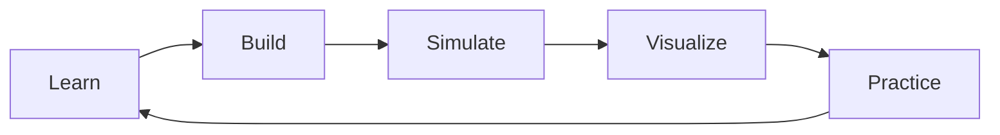
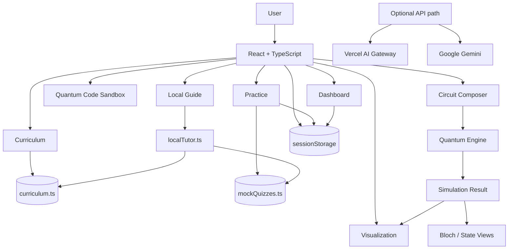
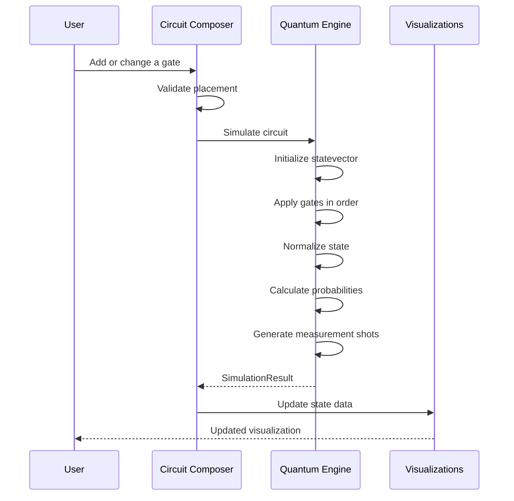
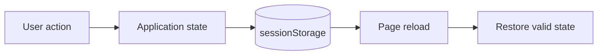
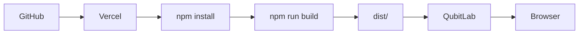

<div align="center">


# QubitLab

### Learn quantum computing by actually playing with it.

Build a circuit. See what changes. Understand the result. Test yourself.

[](https://react.dev/)
[](https://www.typescriptlang.org/)
[](https://vite.dev/)
[](https://threejs.org/)
[](https://tailwindcss.com/)
[](https://vercel.com/)

[Features](#features) · [How it works](#how-it-works) · [Architecture](#architecture) · [Getting started](#getting-started) · [Deployment](#deployment)

</div>

---

## What is QubitLab?

Quantum computing is much easier to understand when you can **see what the math is doing**.

QubitLab is a browser-based learning platform built around that idea. Instead of reading about a quantum gate and moving on, you can put the gate into a circuit, simulate the circuit, inspect the resulting state, visualize it, and then test what you learned.

The learning loop is simple:

```text
        LEARN
          ↓
        BUILD
          ↓
       SIMULATE
          ↓
      VISUALIZE
          ↓
       PRACTICE
          ↓
        REPEAT
```

The project is intentionally focused on **small, understandable quantum systems**. It is a learning lab, not a replacement for large-scale quantum hardware or high-performance simulation software.

---

## Why was it built?

Beginners often meet quantum computing as a collection of formulas:

- `|ψ⟩`
- matrices
- gates
- probabilities
- measurement
- entanglement
- algorithms

The difficult part is connecting those pieces.

QubitLab tries to make that connection visible. If you change the circuit, the state changes with it. If you learn a concept, you can experiment with it. If you are unsure, the local learning guide can look through the material already included in the application.

So the goal is not to make quantum computing look mysterious or overly complicated. The goal is to make it **something you can interact with**.

---

# Features

## Learn

- Structured quantum-computing curriculum
- Foundations, core concepts, gates and circuits, mathematics, and algorithms
- Learning objectives for each topic
- Topic difficulty, duration, and prerequisites

## Build circuits

The Circuit Composer is where the theory becomes hands-on.

- 1–5 configurable qubits
- 4–12 configurable circuit steps
- `H`, `X`, `Y`, `Z`, `S`, `T`, `Rx`, `Ry`, `Rz`
- `S†` and `T†`
- `CNOT` and `CZ`
- `SWAP` and `CCNOT`
- Measurement markers
- Multi-qubit gate placement validation
- Bell, GHZ, Superposition, Grover, Deutsch, and Teleportation presets
- Step-by-step circuit scrubbing
- Clear and reset controls

## Simulate

The circuit is connected to a client-side state-vector simulator rather than being only a visual mock-up.

It supports:

- Complex amplitudes
- State-vector evolution
- Gate-by-gate simulation
- Basis-state probabilities
- Measurement-shot sampling
- Numerical state normalization
- Bloch-vector extraction
- Dirac notation
- Entanglement-aware inspection

## Visualize

Simulation results are presented in several ways so the same state can be understood from different angles:

- State-vector amplitudes
- Probabilities
- Relative phase
- Measurement histograms
- Dirac notation
- Bloch-sphere visualization
- Interactive 3D views using Three.js/WebGL

## Export

Circuits can be translated into educational code for:

- **Qiskit**
- **PennyLane**
- **Cirq**
- **OpenQASM**

The exports are useful for learning and moving a circuit into another environment. They should still be checked against the target SDK/compiler version before production use.

## Practice and progress

Learning does not stop after the circuit runs.

- Module-based MCQs
- Immediate feedback
- Explanations
- Score calculation
- Best-score tracking for the current browser session
- Session-based learner progress
- Dashboard summaries

---

# The Local Learning Guide

The built-in guide was changed during debugging so that the main learning experience does **not depend on an external AI API**.

The current tutor is an offline, deterministic knowledge system. It uses the application's own curriculum and quiz material, along with a compact set of general technical knowledge, to find relevant information and build a response.

```text
curriculum.ts ──────┐
                    ├──> localTutor.ts ──> Local Guide
mockQuizzes.ts ─────┘
```

This gives the guide a few useful properties:

- It works without an API key.
- It works without a network request.
- It responds quickly.
- It is predictable.
- Its quantum explanations are connected to the project's own syllabus.

### What it is not

It is **not a full generative LLM** and it cannot honestly answer every possible question in the world.

That distinction matters. The local guide is designed to be useful, reliable, and available offline rather than pretending to have unlimited knowledge.

The repository still contains an optional server/API path for deployments that want model-backed responses, but the current tutor interface does not depend on `/api/chat`.

---

# How it works

## 1. Start with a concept

Choose a topic from the curriculum. Topics contain the material needed to understand the idea, along with learning objectives and prerequisites.

## 2. Build something

Open the Circuit Composer and place gates on the qubit wires.

A simple Bell-state circuit looks like this:

```text
q₀ ── H ──●────
          │
q₁ ───────X────
```

The composer keeps track of qubits, circuit steps, gate placement, and multi-qubit relationships.

## 3. Simulate

The current circuit is sent to the quantum engine whenever it changes.

```text
Circuit
   ↓
Check gate placement
   ↓
Initialize |00...0⟩
   ↓
Apply gates in order
   ↓
Normalize numerical state
   ↓
Calculate probabilities
   ↓
Sample measurements
   ↓
SimulationResult
```

This means the circuit and the numbers shown beside it come from the same underlying state calculation.

## 4. Understand the result

The result can be inspected through amplitudes, probabilities, measurement shots, Dirac notation, and Bloch-sphere information.

The point is to let the learner answer questions such as:

> What changed after the H gate?
>
> Why are the measurement probabilities different?
>
> What did the CNOT do to the two-qubit state?

## 5. Practice

Once the idea makes sense, the learner can return to the practice modules and check their understanding.



---

# Architecture

Most of QubitLab runs directly in the browser.



### What each part does

| Location | Job |
|---|---|
| `src/components/` | UI and feature components |
| `src/data/` | Curriculum and quiz content |
| `src/types/` | Shared TypeScript types |
| `src/utils/quantumEngine.ts` | State-vector simulation and quantum operations |
| `src/utils/localTutor.ts` | Offline knowledge retrieval and responses |
| `src/utils/progress.ts` | Session-based progress |
| `api/chat.ts` | Optional model-backed API endpoint |
| `server/index.ts` | Optional Express/Vite runtime |
| `vercel.json` | Vercel build and SPA routing |

---

# Circuit Simulation



The important design choice here is that the circuit diagram is not treated as a separate animation. The visual result is driven by the simulated state.

---

# Quantum Engine

The simulation core lives in:

```text
src/utils/quantumEngine.ts
```

| Category | Operations |
|---|---|
| Basic | `H`, `X`, `Y`, `Z` |
| Phase | `S`, `S†`, `T`, `T†` |
| Rotations | `Rx(θ)`, `Ry(θ)`, `Rz(θ)` |
| Controlled | `CNOT`, `CZ` |
| Multi-qubit | `SWAP`, `CCNOT` |
| Analysis | amplitudes, probabilities, phases, Bloch vectors |
| Measurement | shot sampling and histograms |
| Export | Qiskit, PennyLane, Cirq, OpenQASM |

Rotation gates use the standard half-angle convention. For example:

```text
Rx(θ) = cos(θ/2) I − i sin(θ/2) X
```

The engine also normalizes the state after numerical evolution to reduce floating-point drift.

---

# Session Data

Learner progress is intentionally stored in `sessionStorage`.



| Situation | Behavior |
|---|---|
| Navigate around the app | Current progress stays available |
| Reload the page | Valid session state is restored |
| New browser session | Starts with fresh session data |
| Account login | Not implemented |
| Cloud sync | Not implemented |

This keeps the project simple and avoids pretending that it currently has a cloud account system.

---

# Project Structure

```text
Qubit_Lab/
│
├── api/
│   └── chat.ts                  # Optional model-backed API
│
├── docs/
│   └── assets/
│       └── qubitlab-banner.svg  # README/project visual
│
├── server/
│   └── index.ts                 # Optional Express + Vite server
│
├── src/
│   ├── components/
│   │   ├── bloch/               # Bloch-sphere visualization
│   │   ├── chat/                # Local learning guide
│   │   ├── circuit/              # Circuit composer
│   │   ├── curriculum/           # Curriculum UI
│   │   ├── dashboard/            # Learner dashboard
│   │   ├── landing/              # Landing page
│   │   ├── layout/               # Shared layout/navigation
│   │   ├── quiz/                 # Practice modules
│   │   ├── sandbox/              # Quantum code exploration
│   │   └── visualization/        # State/probability views
│   │
│   ├── data/
│   │   ├── curriculum.ts         # Learning content
│   │   └── mockQuizzes.ts        # Quiz content
│   │
│   ├── types/
│   │   └── quantum.ts            # Domain types
│   │
│   ├── utils/
│   │   ├── localTutor.ts         # Offline tutor logic
│   │   ├── progress.ts            # Session progress
│   │   └── quantumEngine.ts       # Simulation core
│   │
│   ├── App.tsx
│   ├── main.tsx
│   └── index.css
│
├── index.html
├── metadata.json
├── package.json
├── bun.lock
├── tsconfig.json
├── vercel.json
├── vite.config.ts
└── README.md
```

---

# Tech Stack

| Technology | Why it is here |
|---|---|
| **React 19** | Builds the interactive application UI |
| **TypeScript 5.8** | Keeps UI and simulation logic type-safe |
| **Vite 6** | Fast development and production builds |
| **Tailwind CSS 4** | Application styling |
| **Motion** | UI animation and interaction |
| **Three.js** | 3D quantum visualization |
| **Lucide React** | Interface icons |
| **Express** | Optional server runtime |
| **Google GenAI** | Optional Gemini integration |
| **Vercel** | Current deployment target |

---

# Getting Started

## Requirements

- Node.js 18+
- npm

Check your versions:

```bash
node --version
npm --version
```

## Clone

```bash
git clone https://github.com/chamanvashishth/Qubit_Lab.git
cd Qubit_Lab
```

## Install

```bash
npm install
```

## Run locally

```bash
npm run dev
```

Vite will print the local development URL in the terminal.

---

# Commands

| Command | Purpose |
|---|---|
| `npm run dev` | Start the Vite development server |
| `npm run lint` | Type-check the project with TypeScript |
| `npm run build` | Build the frontend into `dist/` |
| `npm run start` | Preview the built frontend with Vite |
| `npm run build:server` | Build the frontend and optional Express server bundle |
| `npm run clean` | Remove the `dist/` directory |

Before pushing a change, the useful baseline check is:

```bash
npm run lint
npm run build
```

For changes to the circuit engine, also test a few small circuits manually. Quantum code can look perfectly reasonable while still producing the wrong state.

---

# Deployment

## Vercel

**Vercel is the current deployment path for QubitLab.**

The repository contains `vercel.json` with the Vite build and SPA fallback configuration.



Current build settings:

```text
Framework:      Vite
Build command:  npm run build
Output:         dist
```

The SPA rewrite sends normal application routes to `index.html` while keeping `/api/*` available for API handling.

### GitHub Pages

GitHub Pages is **not** used for the current deployment. The old GitHub Pages workflow was removed during debugging because it was unnecessary and did not match the Vercel-based deployment setup.

---

# Optional AI Configuration

The main local learning guide does not need an API key.

If a deployment intentionally uses the optional server/API path, it can use an AI Gateway credential:

```text
AI_GATEWAY_API_KEY=...
```

or a direct Gemini credential:

```text
GEMINI_API_KEY=...
```

Store these in your hosting provider's environment settings or in an untracked local environment file.

**Never commit API keys, tokens, passwords, or other secrets to Git.**

The API code also distinguishes Vercel AI Gateway credentials from direct Gemini credentials so a Gateway credential is not accidentally sent to Google's Gemini API.

---

# What was fixed during debugging?

The project went through a fairly practical cleanup rather than just a visual rewrite.

### Quantum simulation

- Fixed the `Rx(θ)` matrix implementation.
- Added `Ry` and `Rz` rotations.
- Added `S†` and `T†`.
- Improved controlled-gate handling.
- Added SWAP and Toffoli support.
- Added state normalization after simulation.
- Improved measurement sampling and state analysis.

### Circuit Composer

- Made simulation update with circuit edits.
- Added dynamic qubit and circuit-step sizing.
- Added multi-qubit collision/placement checks.
- Added live probability and measurement views.
- Added Dirac notation and entanglement inspection.
- Added circuit presets and step scrubbing.
- Added exports for Qiskit, PennyLane, Cirq, and OpenQASM.

### Learning experience

- Made curriculum and quiz data drive the learning flow.
- Added session-based progress behavior.
- Added a local tutor backed by the application's syllabus.
- Removed the main tutor UI's dependency on `/api/chat`.

### Deployment and API cleanup

- Removed the obsolete GitHub Pages deployment workflow.
- Kept Vercel as the documented deployment target.
- Hardened optional AI credential handling.
- Avoided exposing credential details in the client application.

The README documents these changes because they affect how the project actually works today.

---

# Known Limits

A few limits are worth being explicit about.

### Small simulations by design

State-vector simulation grows exponentially with the number of qubits. The interactive composer therefore stays within **1–5 qubits**.

### The local guide has a finite knowledge base

It can answer from the material bundled with QubitLab, but it cannot know new web information, private data, or every question a user might ask.

### Progress is session-based

There is no account system or cross-device synchronization yet.

### Exported code needs validation

Generated Qiskit, PennyLane, Cirq, and OpenQASM code is intended as educational/export material. Validate it against the version of the SDK or compiler you are actually using.

---

# Roadmap

The next useful improvements are less about adding random features and more about making the existing learning loop stronger:

- More curriculum modules and worked examples
- More algorithm and circuit challenges
- Stronger automated tests for the quantum engine
- Component and integration tests
- Better circuit-specific explanations in the local guide
- Optional learner accounts
- Cross-device progress synchronization
- More SDK export coverage
- More visualization modes

---

# Contributing

Contributions are welcome. Keep changes focused so they are easy to understand and review.

1. Fork the repository.
2. Create a branch:

```bash
git checkout -b feature/your-change
```

3. Make your change.
4. Run:

```bash
npm run lint
npm run build
```

5. If you changed an interactive feature, test it in the browser.
6. If you changed the quantum engine, include a small circuit or mathematical case that demonstrates the expected result.
7. Make sure no secrets were added.
8. Open a pull request explaining what changed, why it changed, and how you tested it.

---

# Contributors

- [@chamanvashishth](https://github.com/chamanvashishth)
- [@asharma975565-ship-it](https://github.com/asharma975565-ship-it)
- [@hellovneet](https://github.com/hellovneet)
- [@mehfa1](https://github.com/mehfa1)
- [@narayankr03-gif](https://github.com/narayankr03-gif)

---

# License

There is currently no `LICENSE` file in the repository.

If the project is going to be distributed as an open-source project, add an appropriate license before defining reuse or redistribution rights.

---

<div align="center">

**Learn · Build · Simulate · Visualize · Practice**

A small quantum lab for making the theory easier to see.

</div>
